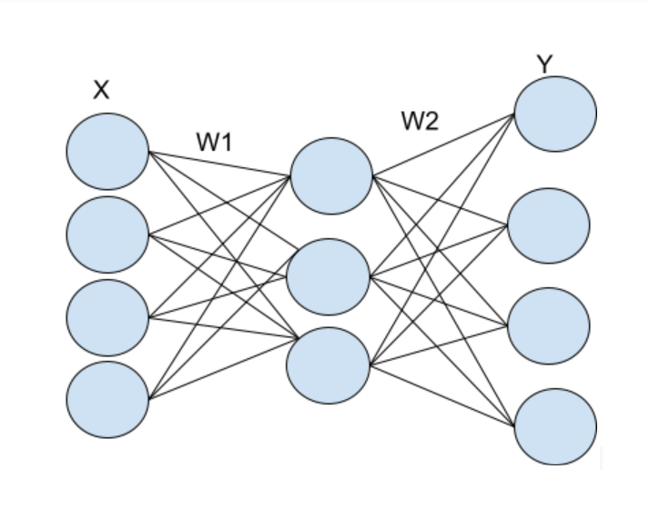

# AutoEncoder
AutoEncoder implemented has one input,one hidden and one output layer.  
The number of nodes in the hidden layer are one less than the input layer.  
Evaluation Metric used:Mean Squared Error  
Backpropagation has been used for training and has been derived from scratch(Refer to A4_2019369_Report.pdf for steps).  
Backpropgation implemented from scratch: Backpropagation_scratch.py  
Backpropgation  using autograd : Autograd_Backpropagation.py 

